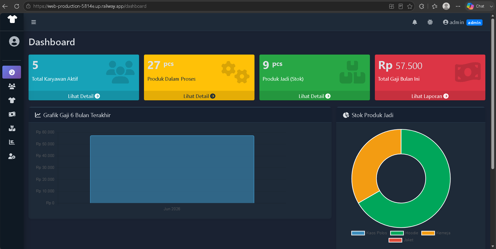
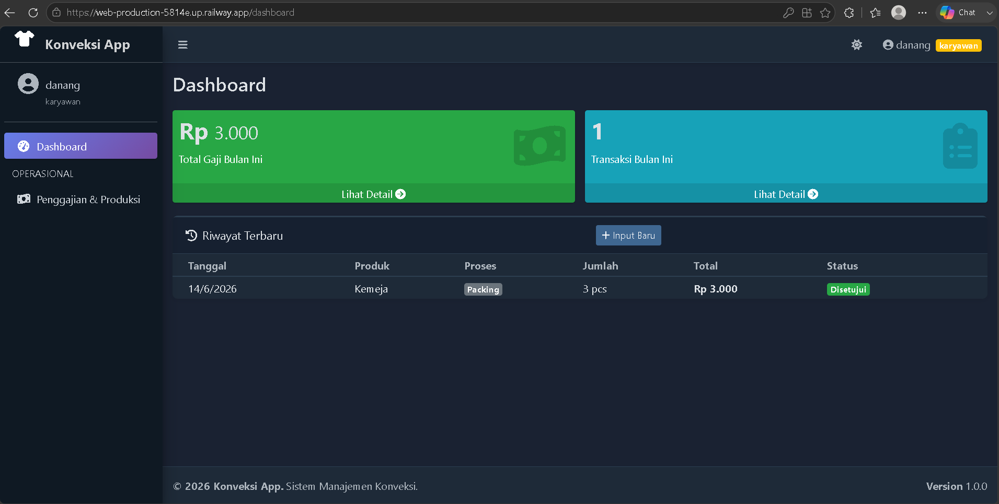

# 🧵 Konveksi App

Sistem manajemen konveksi berbasis web untuk mengelola **penggajian borongan**, **monitoring produksi**, dan **inventaris produk jadi** secara terintegrasi. Dilengkapi sistem **multi-role** (Admin, Owner, Karyawan) dan **Progressive Web App (PWA)**.

---

## 📋 Fitur Utama

| Fitur | Keterangan |
|-------|------------|
| 🔐 Login & Multi-Role | Admin, Owner, Karyawan dengan akses berbeda |
| 👥 Data Karyawan | CRUD karyawan + upload foto profil |
| 👕 Master Produk | Kelola produk + monitoring progress produksi per tahap |
| 💰 Penggajian Borongan | Input gaji sekaligus mencatat progress produksi |
| ✅ Approval System | Karyawan input → Admin setujui → stok otomatis update |
| 🔔 Notifikasi Real-time | Admin dapat notifikasi saat karyawan input penggajian |
| 📦 Inventaris Otomatis | Stok bertambah otomatis saat tahap Packing disetujui |
| 📊 Dashboard | Grafik & statistik real-time berbasis role |
| 📄 Laporan PDF | Export laporan gaji & inventaris ke PDF |
| 🌙 Dark/Light Mode | Tema gelap/terang + otomatis ikut sistem |
| 📱 PWA | Bisa diinstall di HP seperti aplikasi native |

---

## 👥 Hak Akses Per Role

| Fitur | Admin | Owner | Karyawan |
|-------|-------|-------|----------|
| Dashboard & statistik | ✅ | ✅ | ✅ (milik sendiri) |
| Kelola karyawan | ✅ | 👁️ lihat saja | ❌ |
| Kelola produk | ✅ | 👁️ lihat saja | ❌ |
| Input penggajian | ✅ | ❌ | ✅ (milik sendiri) |
| Approve penggajian | ✅ | ❌ | ❌ |
| Lihat semua penggajian | ✅ | ✅ | ❌ |
| Koreksi stok inventaris | ✅ | ❌ | ❌ |
| Laporan & export PDF | ✅ | ✅ | ❌ |
| Manajemen akun | ✅ | ❌ | ❌ |

---

## 🛠️ Tech Stack

- **Backend**: Node.js + Express.js
- **Database**: MySQL
- **Template Engine**: EJS
- **UI Framework**: AdminLTE 3 + Bootstrap 4
- **PDF Export**: PDFKit
- **Upload File**: Multer
- **PWA**: Service Worker + Web App Manifest
- **Deploy**: Railway

---

## 👨‍💻 Pembagian Kontribusi Per Anggota

Berikut rincian fitur dan bagian kode yang dikerjakan oleh masing-masing anggota kelompok.

| # | Anggota | NIM | Fitur yang Dikerjakan | Halaman |
|---|---------|-----|-----------------------|---------|
| 1 | Muhammad Khoirul Mustofa | 202451050 | Login, Dashboard & Sistem Keamanan | `/login`, `/dashboard` |
| 2 | Adib Rizqi Abyanto | 202451070 | Manajemen Karyawan & Manajemen Produk | `/karyawan`, `/produk` |
| 3 | Afriza Yusuf Awaludin | 202451029 | Penggajian Borongan & Monitoring Produksi | `/penggajian` |
| 4 | Siti Mubarokatul Laila W F | 202351115 | Inventaris, Laporan PDF & Notifikasi | `/inventaris`, `/laporan` |

---

### 1️⃣ Muhammad Khoirul Mustofa — Login, Dashboard & Sistem Keamanan

**File utama:** `controllers/authController.js`, `middleware/auth.js`, `app.js`, `config/db.js`

**Fitur Login (`/login`)**

Menangani autentikasi user via `authController.js`. Saat login, password diverifikasi menggunakan `bcrypt.compare()` terhadap hash di database (password tidak pernah disimpan dalam bentuk asli). Jika cocok, data user disimpan ke session (`req.session.user`) beserta role-nya. Logout menghapus session via `req.session.destroy()`.

**Sistem Keamanan — Middleware (`middleware/auth.js`)**

Middleware berperan sebagai "penjaga pintu" yang diperiksa sebelum user mengakses halaman manapun:

| Middleware | Fungsi |
|------------|--------|
| `isLoggedIn` | Cek apakah user sudah login; jika belum → redirect ke `/login` |
| `isAdmin` | Hanya role `admin` yang boleh akses |
| `isAdminOrOwner` | Role `admin` atau `owner` yang boleh akses |
| `isNotOwner` | Admin dan karyawan boleh, owner tidak |
| `isAdminAction` | Hanya admin yang bisa lakukan aksi (lainnya read-only) |

**Fitur Dashboard (`/dashboard`)**

Dashboard menampilkan konten berbeda tergantung role yang login (`app.js` baris 44–103):
- **Admin/Owner**: statistik total karyawan aktif, produk dalam proses, stok jadi, total gaji bulan ini, tabel aktivitas terbaru, grafik gaji 6 bulan terakhir.
- **Karyawan**: hanya total gaji bulan ini milik sendiri + riwayat transaksi sendiri.

Koneksi database menggunakan connection pool di `config/db.js` (maks 10 koneksi bersamaan, konfigurasi dari `.env`).

---

### 2️⃣ Adib Rizqi Abyanto — Manajemen Karyawan & Manajemen Produk

**File utama:** `controllers/karyawanController.js`, `controllers/produkController.js`

**Fitur Manajemen Karyawan (`/karyawan`)**

Mencakup CRUD lengkap karyawan beserta upload foto profil menggunakan library **Multer**:
- Foto disimpan ke `public/uploads/karyawan/` dengan nama unik berbasis timestamp agar tidak bentrok.
- Validasi: hanya file gambar (`.jpg`, `.png`, `.gif`) dengan ukuran maks 2MB yang diterima.
- Saat karyawan **diedit** dan ada foto baru diunggah → foto lama otomatis dihapus dari folder.
- Saat karyawan **dihapus** → file foto ikut dihapus dari folder sebelum record di database dihapus.
- Jika tidak ada foto diunggah saat buat karyawan baru, sistem memakai `default.png`.

**Fitur Manajemen Produk (`/produk`)**

Mencakup CRUD produk beserta halaman detail monitoring produksi:
- Saat produk baru ditambahkan (`store()`), sistem **otomatis membuat record inventaris** dengan `stok_jadi = 0` — tanpa input manual.
- Halaman detail produk (`detail()`) menampilkan progress produksi per tahap (Potong → Jahit → Obras → Sablon → QC → Packing) menggunakan `GROUP BY proses` + `ORDER BY FIELD(...)`.
- Saat produk dihapus, jika masih ada data penggajian terkait, sistem menangkap error `ER_ROW_IS_REFERENCED_2` dan menampilkan pesan yang informatif (produk tidak bisa dihapus).

---

### 3️⃣ Afriza Yusuf Awaludin — Penggajian Borongan & Monitoring Produksi

**File utama:** `controllers/penggajianController.js`, `routes/penggajianRoutes.js`

**Konsep Penggajian Borongan**

Satu kali input penggajian = sekaligus mencatat gaji DAN progress produksi. Gaji dihitung otomatis: `jumlah_pcs × upah_per_pcs` (tarif diambil dari tabel `tarif_proses`).

**Workflow Approval**

| Yang Input | Status Awal |
|------------|-------------|
| Karyawan | `pending` |
| Admin | `approved` langsung |

**Fitur-fitur utama yang dikerjakan (`penggajianController.js`):**

- **`index()`** — Daftar penggajian dengan filter bulan/tahun/karyawan. Karyawan hanya bisa melihat data milik sendiri (filter `WHERE karyawan_id = ?`).
- **`store()`** — Proses simpan penggajian dengan 4 blok logika:
  1. Validasi input (field wajib, proses harus salah satu dari 6 tahap valid, jumlah > 0).
  2. Hitung `total_gaji = jumlah × upah_per_pcs` dan tentukan status berdasarkan role.
  3. Jika proses = `Packing` dan status langsung `approved` → stok inventaris otomatis bertambah.
  4. Jika yang input adalah karyawan → kirim notifikasi ke admin.
- **`approve()`** — Admin setujui penggajian `pending`: ubah status jadi `approved`, dan jika proses `Packing` → update stok inventaris.
- **`destroy()`** — Hapus penggajian dengan aturan: karyawan hanya bisa hapus milik sendiri yang masih `pending`. Jika data `Packing approved` dihapus → stok di-rollback (`GREATEST(stok - jumlah, 0)` agar tidak negatif).
- **`getTarif()`** — Endpoint AJAX untuk auto-fill tarif di form saat user memilih proses, tanpa reload halaman.

---

### 4️⃣ Siti Mubarokatul Laila W F — Inventaris, Laporan PDF & Notifikasi

**File utama:** `controllers/inventarisController.js`, `controllers/laporanController.js`, `controllers/notifikasiController.js`, `controllers/akunController.js`, `public/js/main.js`

**Fitur Inventaris (`/inventaris`)**

Stok **tidak diinput manual** — berubah otomatis dari modul penggajian. Admin hanya bisa melakukan koreksi jika ada selisih fisik:
- `index()`: menampilkan daftar produk + stok jadi + nilai rupiah (`stok_jadi × harga_jual`) + total nilai seluruh stok.
- `koreksi()`: update stok ke nilai yang diinginkan, dengan validasi stok tidak boleh negatif.

**Fitur Laporan PDF (`/laporan`)**

- Halaman laporan menampilkan rekap gaji per karyawan, rekap produksi per proses, dan grafik tren gaji 6 bulan terakhir — bisa difilter per bulan/tahun.
- **Export PDF Gaji** (`exportPdfGaji()`): menggunakan library **PDFKit** untuk membuat file PDF langsung dari Node.js. Header HTTP diset agar browser otomatis download (`Content-Disposition: attachment`). PDF berisi daftar transaksi gaji + grand total.
- **Export PDF Inventaris** (`exportPdfInventaris()`): format tabel nama produk, stok, harga jual, nilai stok, dan total nilai keseluruhan.

**Fitur Notifikasi Real-time (`/notifikasi`)**

Bekerja berbasis AJAX — JavaScript di browser polling data dari server tanpa refresh halaman:
- Notifikasi otomatis dibuat saat karyawan submit penggajian.
- Auto-hapus notifikasi yang sudah lebih dari 30 hari.
- Menampilkan badge angka merah di navbar untuk notifikasi yang belum dibaca.
- Admin bisa tandai semua sudah dibaca atau hapus semua notifikasi.

**Fitur Manajemen Akun (`/akun`)**

- `store()`: buat akun baru dengan validasi username unik, password minimal 6 karakter, dan hash bcrypt sebelum disimpan.
- `destroy()`: proteksi ganda — tidak bisa hapus akun sendiri, dan tidak bisa hapus akun `owner`.

**Fitur Frontend (`public/js/main.js`)**

| Fitur | Cara Kerja |
|-------|------------|
| Auto-hide flash message | Pesan sukses/error otomatis fade out setelah 4 detik |
| Konfirmasi sebelum hapus | Dialog konfirmasi muncul sebelum aksi hapus dieksekusi |
| Format angka rupiah | Input harga dibersihkan dari karakter non-angka |
| Proteksi double-submit | Tombol Submit di-disable setelah diklik agar tidak submit 2x |

---

## 🚀 Cara Menjalankan Lokal

### 1. Clone Repository
```bash
git clone https://github.com/khoirul45/konveksi-app.git
cd konveksi-app
```

### 2. Install Dependencies
```bash
npm install
```

### 3. Setup Database MySQL

Buat database dan jalankan SQL:
```bash
mysql -u root -p < database/konveksi.sql
```

Atau buka **phpMyAdmin** → Import → pilih file `database/konveksi.sql`

### 4. Konfigurasi .env

Salin file contoh:
```bash
cp .env.example .env
```

Edit file `.env`:
```env
PORT=3000
DB_HOST=localhost
DB_USER=root
DB_PASSWORD=password_mysql_kamu
DB_NAME=konveksi_db
SESSION_SECRET=ganti_dengan_string_random
```

### 5. Jalankan Aplikasi
```bash
npm run dev
```

### 6. Buka Browser
```
http://localhost:3000
```

**Akun Default:**
| Username | Password | Role |
|----------|----------|------|
| admin | Admin@123 | Admin |
| owner | Owner@456 | Owner |

> Akun karyawan dibuat oleh admin melalui menu **Manajemen Akun**

---

## 📁 Struktur Folder

```
konveksi-app/
├── app.js                      # Entry point + konfigurasi server
├── config/
│   └── db.js                   # Koneksi MySQL (mysql2/promise)
├── controllers/
│   ├── authController.js       # Login & logout
│   ├── karyawanController.js   # CRUD karyawan + upload foto
│   ├── produkController.js     # CRUD produk + detail progress
│   ├── penggajianController.js # Input gaji, approval, produksi
│   ├── inventarisController.js # Stok produk jadi
│   ├── laporanController.js    # Laporan + export PDF
│   ├── akunController.js       # Manajemen akun user
│   └── notifikasiController.js # Notifikasi real-time
├── routes/                     # Routing semua modul
├── middleware/
│   └── auth.js                 # Middleware role-based access
├── views/
│   ├── partials/               # Header & footer layout
│   ├── karyawan/               # Views CRUD karyawan
│   ├── produk/                 # Views produk & detail
│   ├── penggajian/             # Views input & approval
│   ├── inventaris/             # Views stok
│   ├── laporan/                # Views laporan + grafik
│   ├── akun/                   # Views manajemen akun
│   ├── dashboard.ejs           # Halaman utama (role-based)
│   └── login.ejs               # Halaman login
├── public/
│   ├── css/style.css           # Custom CSS + dark mode
│   ├── js/main.js              # Custom JS
│   ├── icons/                  # Icon PWA (8 ukuran)
│   ├── manifest.json           # PWA manifest
│   ├── service-worker.js       # PWA service worker
│   └── uploads/karyawan/       # Foto karyawan
├── database/
│   └── konveksi.sql            # Schema + seed data
├── .env.example                # Template konfigurasi
├── Procfile                    # Untuk Railway deploy
└── package.json
```

---

## 🗃️ Skema Database

```
users          — Akun login (admin / owner / karyawan)
karyawan       — Data karyawan + foto
produk         — Master jenis produk
tarif_proses   — Upah per pcs per tahap (Potong/Jahit/dll)
penggajian     — Transaksi gaji + record produksi + status approval
inventaris     — Stok produk jadi (otomatis dari Packing)
notifikasi     — Notifikasi sistem (auto-delete 30 hari)
```

**Alur Otomatis:**
```
Karyawan input Penggajian (status: pending)
         ↓
Notifikasi masuk ke Admin
         ↓
Admin klik Setujui (status: approved)
         ↓
Jika proses = Packing → inventaris.stok_jadi += jumlah
         ↓
Dashboard & Inventaris update otomatis
```

---

## ☁️ Deploy ke Railway

### Langkah-langkah:

1. **Push ke GitHub** (lihat bagian di atas)

2. **Buat akun Railway** → [railway.app](https://railway.app)

3. **New Project** → Deploy from GitHub Repo → pilih repo ini

4. **Tambah MySQL Plugin**:
   - Di dashboard Railway → klik **+ New** → **Database** → **MySQL**

5. **Set Environment Variables** di Railway → tab Variables:
   ```
   DB_HOST     = ${{MySQL.MYSQLHOST}}
   DB_USER     = ${{MySQL.MYSQLUSER}}
   DB_PASSWORD = ${{MySQL.MYSQLPASSWORD}}
   DB_NAME     = ${{MySQL.MYSQLDATABASE}}
   DB_PORT     = ${{MySQL.MYSQLPORT}}
   SESSION_SECRET = random_string_panjang
   ```

6. **Import database** via Railway MySQL Console:
   - Upload file `database/konveksi.sql`
   - Jalankan: `mysql -u root -p$MYSQL_ROOT_PASSWORD $MYSQL_DATABASE < /path/konveksi.sql`

7. Railway akan deploy otomatis dan memberikan URL publik

---

## 📸 Screenshots

### Dashboard Admin
> Menampilkan statistik real-time: total karyawan, produk dalam proses, stok jadi, total gaji, grafik bulanan, dan aktivitas terbaru.
   
### Dashboard Karyawan
> Menampilkan riwayat penggajian milik sendiri dan tombol input penggajian baru.
   

---

## 👨‍💻 Pengembang

| No | Nama | NIM | Prodi | Universitas |
|----|------|-----|-------|-------------|
| 1 | Muhammad Khoirul Mustofa | 202451050 | Teknik Informatika | Muria Kudus |
| 2 | Adib Rizqi Abyanto | 202451070 | Teknik Informatika | Muria Kudus |
| 3 | Afriza Yusuf Awaludin | 202451029 | Teknik Informatika | Muria Kudus |
| 4 | Siti Mubarokatul Laila W F | 202351115 | Teknik Informatika | Muria Kudus |

---

## 📄 Lisensi

MIT License — bebas digunakan untuk keperluan akademik.
